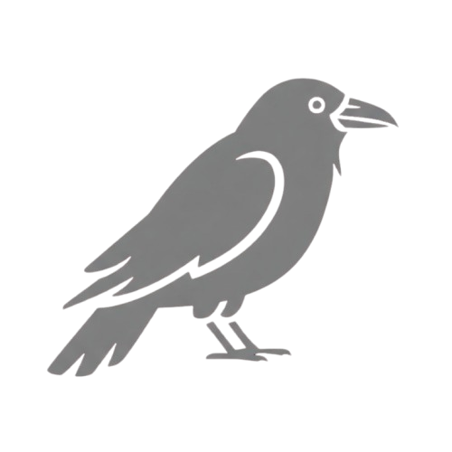
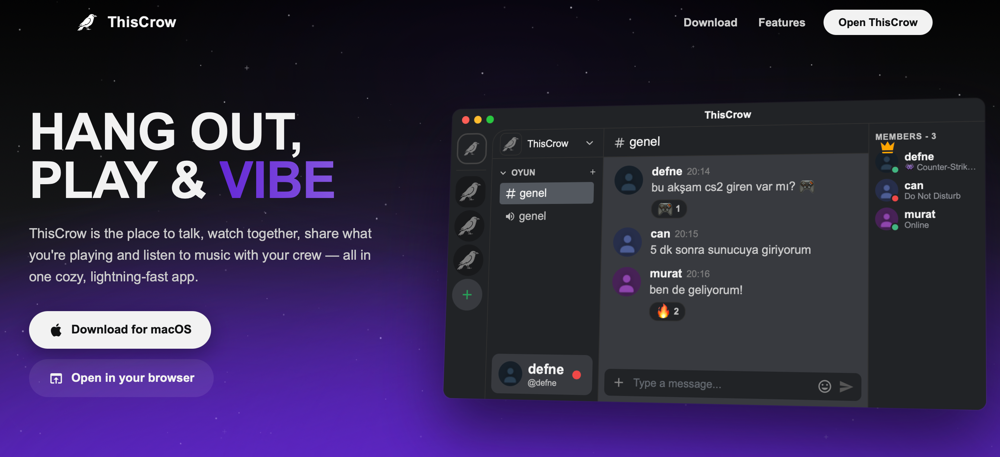
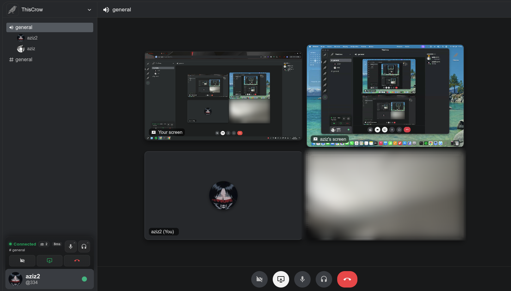
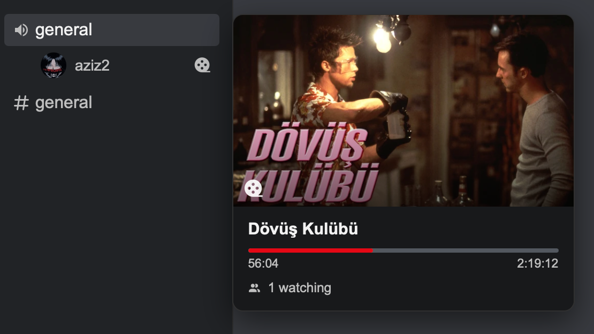
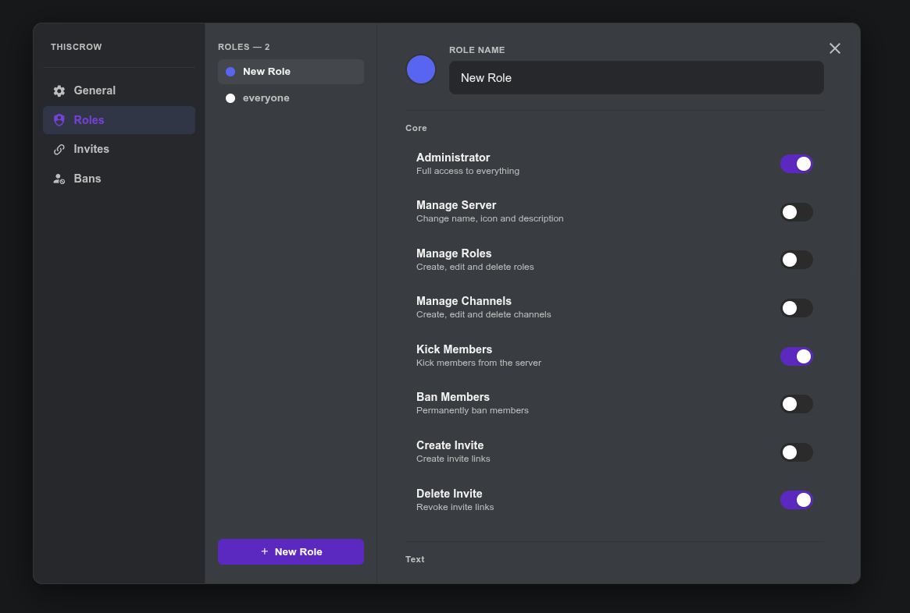
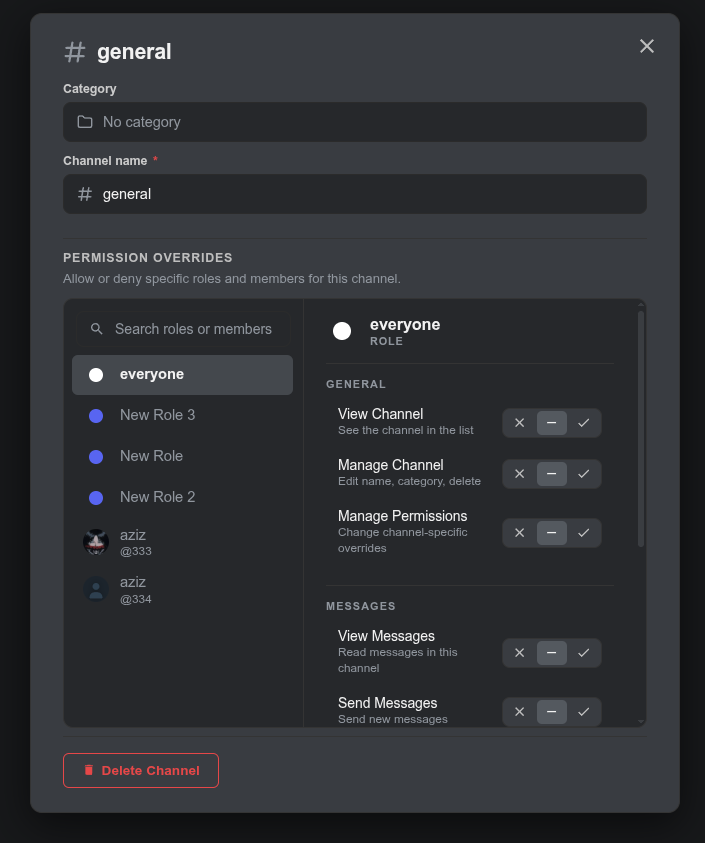
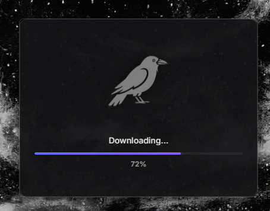

# ThisCrow

### Download the desktop app

&nbsp;

&nbsp;

&nbsp;

---

ThisCrow is a Discord-like, real-time communication platform — the place to talk, watch
together, and share what you're playing and listening to with your crew, all in one cozy,
lightning-fast app.

## Features

### 📹 Video Chat & Screen Casting

Jump into voice and video channels, turn on your camera, and share your screen with the
room. Multiple people can stream at once, so you can game, work, or hang out side by side.

### 🎬 Watch Party

Watch movies and videos together, perfectly in sync. Playback, pausing, and seeking are
shared with everyone in the room, and you can see who's tuned in at a glance.

### 🎮 Activity

Show your crew what you're up to. ThisCrow surfaces the game you're playing and the track
you're listening to right on your profile, so everyone can jump in.

### 🛡️ Server Settings

Run your server your way. Create roles with granular permissions, and manage invites and
bans — all from one clean settings panel.

### ⚙️ Channel Settings

Fine-tune each channel: set its category and name, and control access with allow/deny
permission overrides for any role or member.

### 🔒 End-to-End Encryption (E2EE)

Direct messages are encrypted on your device and can only be read by you and the person
you're talking to — not even the server can see them. Keys are exchanged with X25519 and
messages are sealed with AES-GCM, all running in a WebAssembly crypto core.

### ⬇️ Auto Updates

The desktop app keeps itself up to date. New versions download and install seamlessly in
the background — you always run the latest build without lifting a finger.
